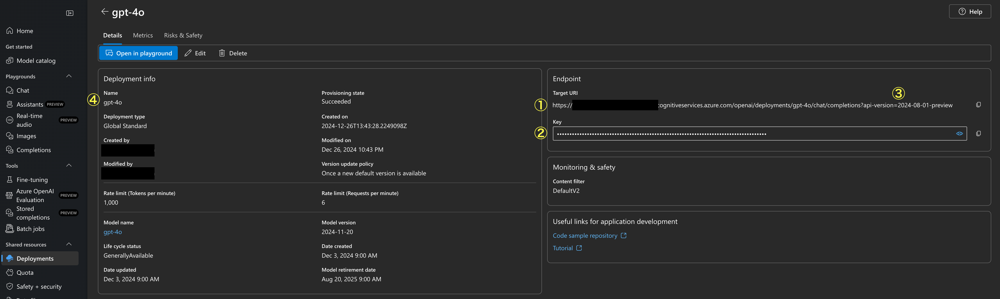

# azure-openai-experiment

Azure OpenAI を JavaScript の SDK で実行する実験用プロジェクトです。

## 事前準備

- Node.js バージョン 20 以上
- Azure OpenAI Service 上でモデルのデプロイが完了していること

## 実行方法

1. `.env.template`をコピーし、`.env` ファイルを作成します。
2. `.env` ファイルに必要な環境変数を設定します。

```
AZURE_OPENAI_ENDPOINT=< ① >
AZURE_OPENAI_API_KEY=< ② >
OPENAI_API_VERSION=< ③ >
AZURE_OPENAI_DEPLOYMENT_NAME=< ④ >
```

各設定値は Azure OpenAI Service の Deployment info ビューで確認できます。



3. 依存関係をインストールします。

```
npm install
```

4. プロジェクトを実行します。

```
npm start
```

## 実行例

```
$ npm start

> azure-openai-experiment@1.0.0 start
> node --env-file=.env index.js

{
  content: 'CoderDojoではさまざまな役割を持つ人々が一緒に活動し、子どもたち（Ninjaと呼ばれます）の学びをサポートしています。では、それぞれの役割について具体的に説明しますね！\n' +
    '\n' +
    '---\n' +
    '\n' +
    '### 1. **チャンピオン（Champion）**\n' +
    '- **役割**: Dojo（CoderDojoの開催拠点）を立ち上げたり運営したりする人のことです。Dojoの責任者にあたります。\n' +
    '- **特徴**: イベントの日程調整や場所の確保、参加者募集など、Dojo全体の管理を担当します。技術的なスキルがなくても問題ありません。\n' +
    '- **ポイント**: コミュニケーション能力や運営力が重要です。\n' +
    '\n' +
    '---\n' +
    '\n' +
    '### 2. **メンター（Mentor）**\n' +
    '- **役割**: 子どもたち（Ninja）がプログラミングやデジタル制作をしている際にサポートする人のことです。\n' +
    '- **特徴**: 必ずしもプロのエンジニアやプログラマーである必要はなく、自分の得意分野を活かして子どもたちを教える役割を担います。\n' +
    '- **ポイント**: 応用力やサポート能力が大切で、「答えを教えるのではなく方向性を示す」姿勢が推奨されます。\n' +

    'CoderDojoはこのように多くの人たちが協力して成り立つコミュニティです。それぞれが役割を持ちながら、子どもたちの「創る」意欲を応援しているのが素晴らしいところですね！',
  refusal: null,
  role: 'assistant'
}
```

※content は長いので一部省略しています。
